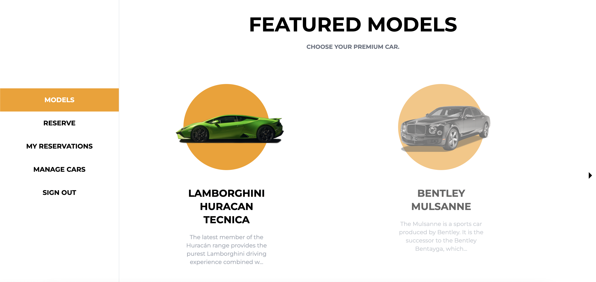

# Car Booking Service




## Live Versions

- [Front-End](https://62841455ea5ce52646803a1c--tangerine-faloodeh-288b4c.netlify.app/)
- [Back-end](https://car-booking-premium.herokuapp.com)

## Link to the backend

- [Backend](https://github.com/DelhinRharl/car-booking-service-back-end)

## Built With

- ReactJS
- Redux Toolkit
- TailwindCSS

## Getting Started

- Getting a local copy is simple. Follow the steps below

### Install

- Node
- npm
- git

### Local Copy

- Clone the project

```
git clone https://github.com/DelhinRharl/car-booking-service-front-end
```

## Setup

### For the frontend

```
npm install
```

Start server(frontend):

```
npm start
```

The front end app will open automatically to the default browser

### Run the tests

```
npm run test
```

## Authors

👤 **Anuar Shaidenov**

- GitHub: [@anuarshaidenov](https://github.com/anuarshaidenov)
- Twitter: [@anuarnyi](https://twitter.com/anuarnyi)
- LinkedIn: [Anuar Shaidenov](https://www.linkedin.com/in/anuar-shaidenov-365a951b8/)

👤 **Affaxed Kiprotich**

- GitHub: [@DelhinRharl](https://github.com/DelhinRharl)
- Twitter: [@affax-kiprotich](https://twitter.com/affax-kiprotich)
- LinkedIn: [Affaxed Kiprotich](https://www.linkedin.com/in/affaxed-kiprotich/)

👤 **Charles Gobina**

- GitHub: [@charlesgobina](https://github.com/charlesgobina)
- Twitter: [@charles_gobina](https://twitter.com/charles_gobina)
- LinkedIn: [Charles Gobina](https://www.linkedin.com/in/charlesgobina/)

👤 **Kevin Koome**

- GitHub: [@koomekevo](https://github.com/koomekevo)
- Twitter: [@koomekevo](https://twitter.com/koomekevo)
- LinkedIn: [LinkedIn](https://ke.linkedin.com/in/kevin-koome-aab84186)

👤 Bohdan Shcherbak

- GitHub: [@akucintavalent](https://github.com/akucintavalent)
- Twitter: [@ibodi828](https://twitter.com/ibodi828)
- LinkedIn: [LinkedIn](https://www.linkedin.com/in/bohdan-shcherbak/)

## 🅰️ Acknowledgements

The design template is provided by
[Creative Commons](https://creativecommons.org/)

## 🤝 Contributing

Contributions, issues, and feature requests are welcome!

## Show your support

Give a ⭐️ if you like this project!
